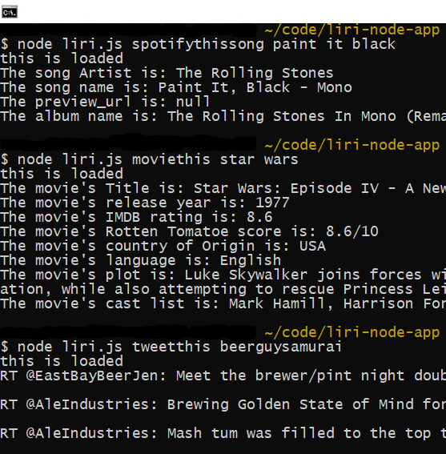

# liri-node-app

#### Overview
LIRI is a command line node app that takes in parameters and gives you back data.  The parameters the app takes in are song titles, movie titles and tweet handles.
#### Directory Layout
```
liri-node-app
    - assets
        - images
    - node_modules
    - .env
    - .gitignore
    - keys.js
    - liri.js
    - package-lock.json
    - package.json
    - random.txt

```
#### Setup

1. Clone the repo: [here](https://github.com/Malkons/liri-node-app.git)

2.  Install Node.js if you haven't already. [node.js](https://nodejs.org/en/)

3. npm install in the directory where the repo is cloned

4.  At the command line use the following commands to get started.

```
   For Spotify: node liri.js spotifythissong "song title"
                example: node liri.js spotifythissong paint it black

   For OMDB: node liri.js moviethis "movie title"
                example: node liri.js moviethis star wars

   For Twitter: node liri.js tweetthis "twitter username"
                example: node liri.js tweetthis beerguysamurai                            
```

#### Screenshot

At the Dollar sign enter the example above and get the example below.

